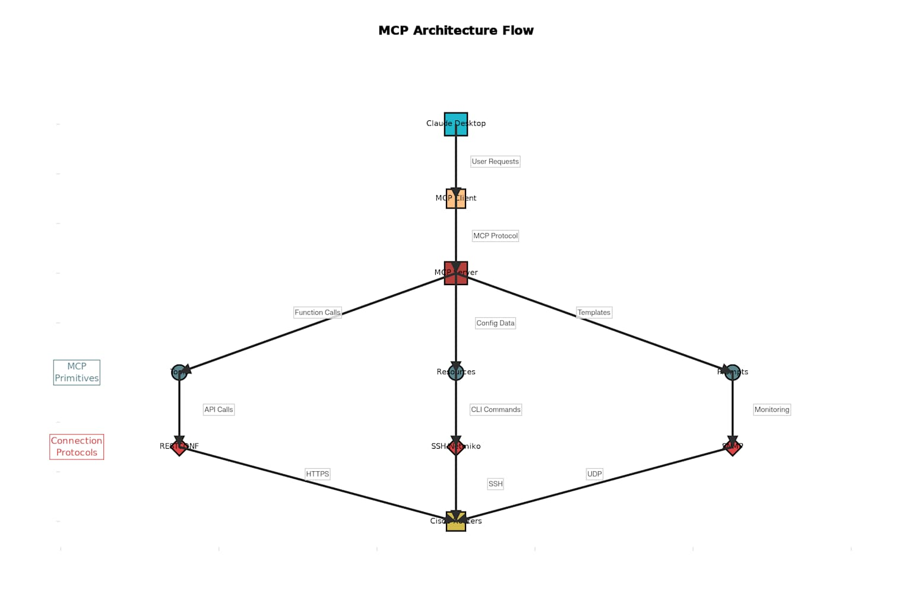

# Cisco Router MCP Server Demo

Welcome to the **Art of Possibility**: a hands-on demonstration of how you can use Claude Desktop, Model Context Protocol (MCP), and Python to manage Cisco routers with natural language and automation.

---

## 🚀 Overview

This project shows how you can:
- Seamlessly connect Claude Desktop to your Cisco routers using MCP.
- Run show commands, retrieve configurations, and push configuration changes—all from a conversational AI interface.
- Easily scale this approach to your entire IT infrastructure.

All code and instructions are included in this repository.  
**[⭐ Star this repo if you find it useful! All scripts are open source. ⭐]**

---

## 📊 Architecture

### MCP Architecture Flow

**Key Flow:**
- **Claude Desktop** receives user requests and communicates with the MCP server via the MCP protocol.
- The **MCP server** exposes tools and resources, translating requests into API calls, CLI commands, or monitoring actions.
- **Netmiko** (SSH) and other protocols handle the actual device interactions.
- **Cisco Routers** are managed securely and programmatically.

---

### GNS3 Lab Topology

- **PC1** (running Claude Desktop) connects to **R2** and **R1** in series, with R1 connected to the cloud.
- This setup is easily extensible for larger labs or production networks.

---

## 📝 Features

- **Natural Language Network Management:** Use Claude Desktop to interact with your routers.
- **MCP Server in Python:** Powered by FastMCP and Netmiko.
- **Multi-Device Support:** Easily add more routers to your inventory.
- **Secure SSH Automation:** All actions are performed over SSH using best practices.

---

## 📦 Files Included

- `mcp_server.py` — Main MCP server script ([see code](./mcp_server.py))
- `requirements.txt` — Python dependencies ([see file](./requirements.txt))
- `image.jpg` — MCP architecture diagram
- `Topology.jpg` — GNS3 lab topology

---

## ⚡ Quick Start

1. **Clone this repo:**
