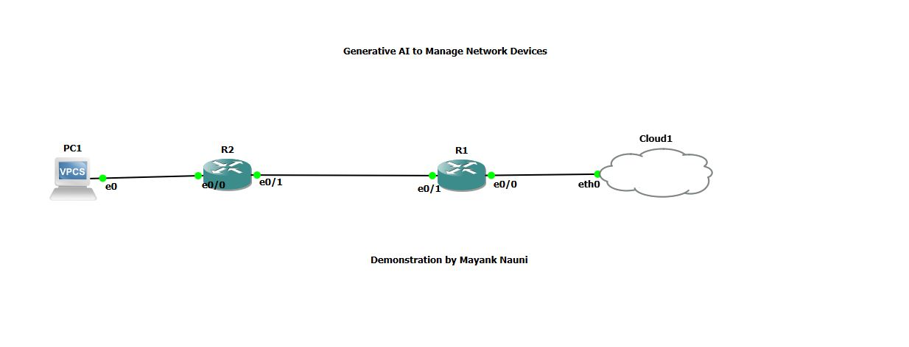

# Claude MCP Cisco Demo

Welcome to the **Claude MCP Cisco Demo**!  
This project demonstrates how to use [Claude Desktop](https://www.anthropic.com/claude), the [Model Context Protocol (MCP)](https://modelcontextprotocol.io/), and Python to manage Cisco routers using natural language and automation.

---

## 📚 Table of Contents

- [Overview](#overview)
- [Architecture](#architecture)
- [Lab Topology](#lab-topology)
- [Features](#features)
- [Getting Started](#getting-started)
  - [1. Requirements](#1-requirements)
  - [2. Clone & Set Up](#2-clone--set-up)
  - [3. Configure Your Routers](#3-configure-your-routers)
  - [4. MCP Server Setup](#4-mcp-server-setup)
  - [5. Claude Desktop Integration](#5-claude-desktop-integration)
  - [6. Run & Test](#6-run--test)
- [Usage Examples](#usage-examples)
- [Security Notes](#security-notes)
- [FAQ & Troubleshooting](#faq--troubleshooting)
- [License](#license)

---

## Overview

This repo shows how to:
- Connect Claude Desktop to Cisco routers via the Model Context Protocol (MCP)
- Run show commands, retrieve configs, and push changes—all via natural language
- Scale the approach to your entire IT infrastructure

All code and instructions are included.  
**All scripts and diagrams are open source—see [LICENSE](#license).**

---

## Architecture

**MCP Architecture Flow**

- **Claude Desktop**: User interacts with AI
- **MCP Client**: Bridges Claude with the MCP server
- **MCP Server**: Exposes tools/resources, translates requests
- **Netmiko/SSH**: Secure connection to Cisco routers
- **Routers**: Managed devices

---

## Lab Topology

**GNS3 Lab Topology**

- **PC1**: Runs Claude Desktop and MCP server
- **R2, R1**: Cisco routers (can be real or emulated)
- **Cloud**: Simulates WAN/Internet

---

## Features

- **Natural Language Network Management**: Use Claude to interact with your routers
- **Python MCP Server**: Powered by [FastMCP](https://pypi.org/project/fastmcp/) and [Netmiko](https://github.com/ktbyers/netmiko)
- **Multi-Device Support**: Easily add more routers
- **Secure SSH Automation**: All actions over SSH

---

## Getting Started

### 1. Requirements

- Python 3.10+
- Claude Desktop (see [Anthropic](https://www.anthropic.com/claude))
- Cisco routers (real or GNS3/Packet Tracer/CSR1000v)
- [GNS3](https://www.gns3.com/) (optional, for emulation)
- SSH enabled on routers

### 2. Clone & Set Up

git clone https://github.com/yourusername/claude-mcp-cisco-demo.git
cd claude-mcp-cisco-demo
python -m venv venv
On Windows:

venv\Scripts\activate
On Mac/Linux:

source venv/bin/activate
pip install -r requirements.txt

text

### 3. Configure Your Routers

- Make sure SSH is enabled and reachable from your desktop.
- Example Cisco config:

conf t
hostname R1
username admin privilege 15 secret Cisco123
ip domain-name lab.local
crypto key generate rsa modulus 2048
ip ssh version 2
line vty 0 4
login local
transport input ssh
end

text

### 4. MCP Server Setup

- Edit `mcp_server.py` and update the router IPs and credentials:

router_manager.add_router("R1", RouterConfig(
host="1.1.1.1", # Replace with your router's IP
username="admin",
password="Cisco123"
))
router_manager.add_router("R2", RouterConfig(
host="2.2.2.2",
username="admin",
password="Cisco123"
))

text

### 5. Claude Desktop Integration

- Find your Claude Desktop config file (typically `%APPDATA%\Claude\claude_desktop_config.json` on Windows).
- Add/replace with:

{
"mcpServers": {
"cisco-router-manager": {
"command": "C:\Users\youruser\claude-mcp-cisco-demo\venv\Scripts\python.exe",
"args": [
"C:\Users\youruser\claude-mcp-cisco-demo\mcp_server.py"
]
}
}
}

text
- Restart Claude Desktop.

### 6. Run & Test

- Start the MCP server manually (for debugging):

python mcp_server.py

text
- Or let Claude Desktop launch it automatically when you use a tool.

---

## Usage Examples

**Show command:**

{
"router": "R2",
"command": "show ip interface brief"
}

text

**Config command:**

{
"router": "R2",
"command": [
"interface GigabitEthernet0/1",
"description Configured by MCP",
"no shutdown"
]
}

text

**Use built-in tools:**
- `get_config` to fetch running config
- `configure_interface` to set interface IPs

---

## Security Notes

- **Never commit real device credentials to public repositories.**
- For production, use environment variables or a secrets manager.
- Restrict SSH access to trusted hosts only.

---

## FAQ & Troubleshooting

- **SSH errors?**  
  Ensure your router supports modern SSH KEX algorithms or set Netmiko’s `kex_algorithms` as described in [issues](#).
- **Claude Desktop can’t find the server?**  
  Double-check your Python path in the config and that dependencies are installed in the right venv.

---

## License

MIT License

---

**All code and diagrams are shared for learning and inspiration. Fork, adapt, and build your own AI-powered network automation!**

---

**Demo and documentation by Mayank Nauni**

---

